#净金收入比模型Y7 
按照规定选择变量，分析了3个行业和总行业在两个时间段的情况，分别从交叉验证，预测误差，预测与真实情况的对比来展现结果

##ICT
###交叉验证
#####97-15
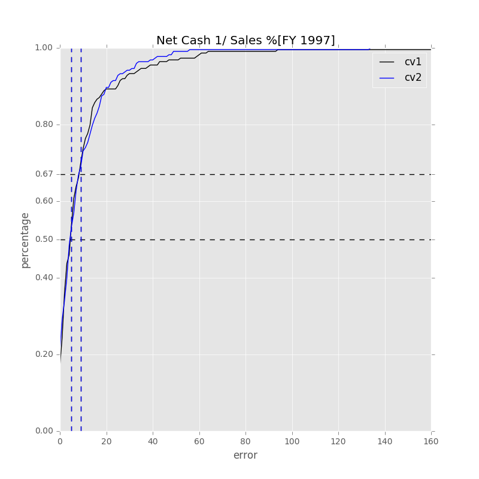
	Label: Net Cash 1/ Sales %[FY 1997]
	Average Min Error: 	0.005377
	Average Mean Error: 	22.632980
	Average Median Error: 	4.854059
	Average Max Error: 	2665.511444

#####10-15
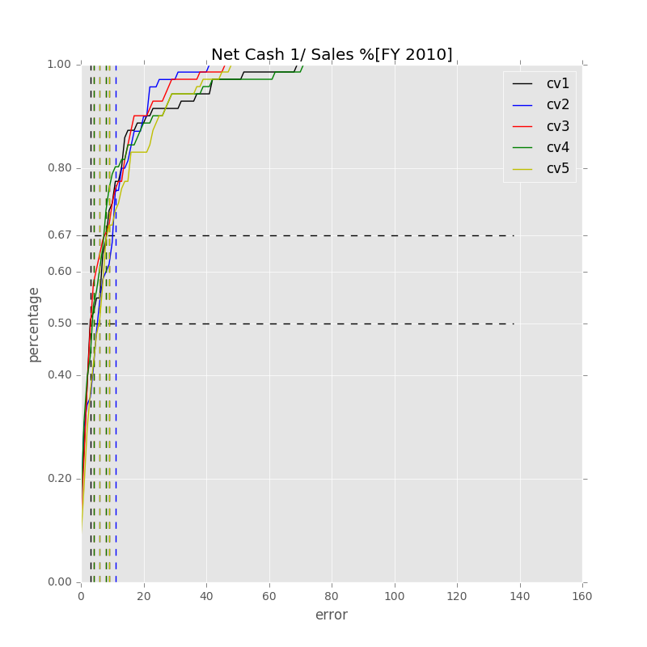

	Label: Net Cash 1/ Sales %[FY 2010]
	Average Min Error: 	0.044370
	Average Mean Error: 	11.307356
	Average Median Error: 	6.154906
	Average Max Error: 	87.308241

###预测误差
#####97-15
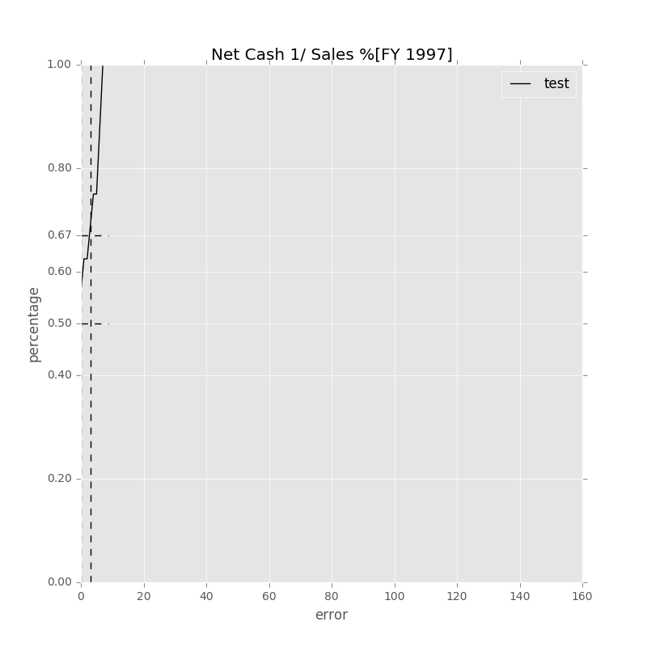

	Label: Net Cash 1/ Sales %[FY 1997]
	Min Error: 	0.481509
	Mean Error: 	2.778106
	Median Error: 	0.861420
	Max Error: 	7.865807
	Feature importance:
		Gross Margin % : 0.086700
		Net Income Margin % : 0.075278
		Total Liabilities/Total Assets % : 0.074986
		Rev YOY % : 0.074468
		Total Asset Turnover : 0.074135
		Net Property, Plant & Equipment/ Total Assets % : 0.071745
		Avg. Cash Conversion Cycle  (Days): 0.069206
		Avg. Days Sales Out.  (Days): 0.067445
		Cash from Ops./Net Income% : 0.067160
		Total Debt/Equity % : 0.063845
		R&D Exp./Total Revenue % : 0.060762
		Avg. Days Payable Out.  (Days): 0.057931
		Goodwill/Total Asset % : 0.057053
		cash flow risk: 0.046440
		Payout Ratio  (%): 0.030943
		Issuer Credit Rating - Foreign Currency LT [Latest] (Rating): 0.021904

	Total Min: 0.481509
	Total Mean: 2.778106
	Total Median: 0.861420
	Total Max: 7.865807
	prediction and real value:
	1998:	-0.138580    -1.000000
	1999:	-0.138580    -1.000000
	2000:	-0.138580    -1.000000
	2001:	-0.138580    -1.000000
	2002:	-0.138580    -1.000000
	2003:	-0.138580    -1.000000
	2004:	-0.138580    -1.000000
	2005:	-0.138580    -1.000000
	2006:	6.193849    5.712340
	2007:	13.033410    8.036704
	2008:	11.247291    11.825114
	2009:	10.468292    12.634866
	2010:	6.801540    13.417506
	2011:	16.292972    23.281000
	2012:	16.625625    20.602759
	2013:	21.222348    23.113289
	2014:	18.143754    24.646376
	2015:	19.174030    27.039837
	2016:	20.529901    24.359445

#####10-15
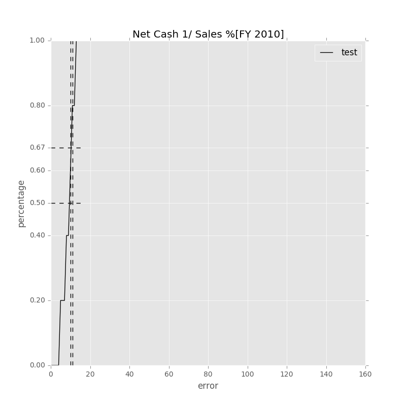

	Label: Net Cash 1/ Sales %[FY 2010]
	Min Error: 	3.176980
	Mean Error: 	10.361614
	Median Error: 	8.993704
	Max Error: 	17.146846
	Feature importance:
		Total Asset Turnover : 0.078573
		Net Property, Plant & Equipment/ Total Assets % : 0.076099
		Total Liabilities/Total Assets % : 0.075945
		Rev YOY % : 0.075257
		Net Income Margin % : 0.070329
		Goodwill/Total Asset % : 0.070122
		Cash from Ops./Net Income% : 0.068753
		Avg. Days Sales Out.  (Days): 0.067487
		Avg. Cash Conversion Cycle  (Days): 0.066904
		Total Debt/Equity % : 0.066697
		Avg. Days Payable Out.  (Days): 0.065138
		Gross Margin % : 0.064685
		R&D Exp./Total Revenue % : 0.053657
		Payout Ratio  (%): 0.045883
		cash flow risk: 0.029858
		Issuer Credit Rating - Foreign Currency LT [Latest] (Rating): 0.024612

	Total Min: 3.176980
	Total Mean: 10.361614
	Total Median: 8.993704
	Total Max: 17.146846
	prediction and real value:
	2011:	6.507284    23.281000
	2012:	23.779739    20.602759
	2013:	40.260135    23.113289
	2014:	35.138424    24.646376
	2015:	34.124568    27.039837
	2016:	31.854804    24.359445

###预测与真实值对比
#####97-15
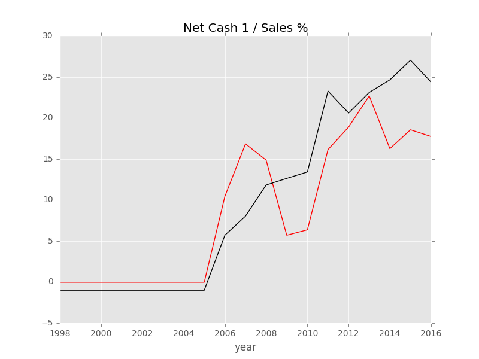
#####10-15
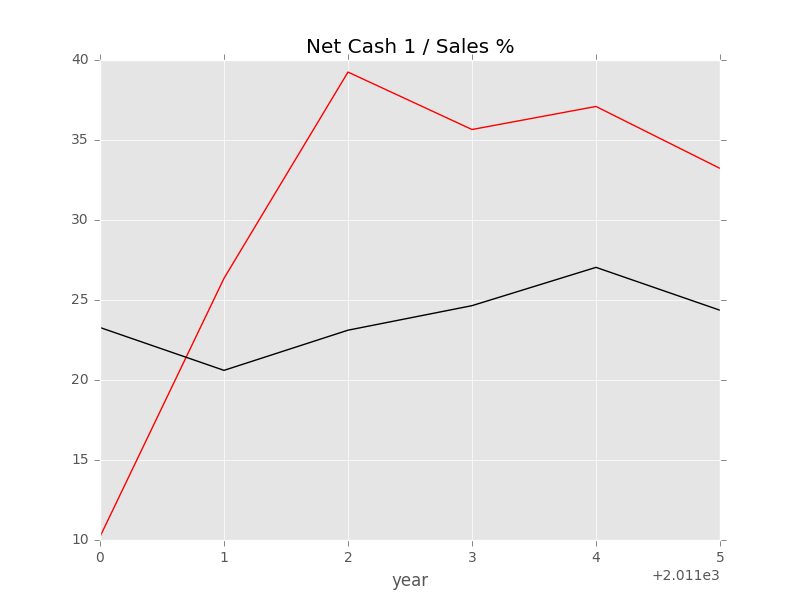

##ICT-Semiconductors and Semiconductor Equipment
###交叉验证
#####97-15
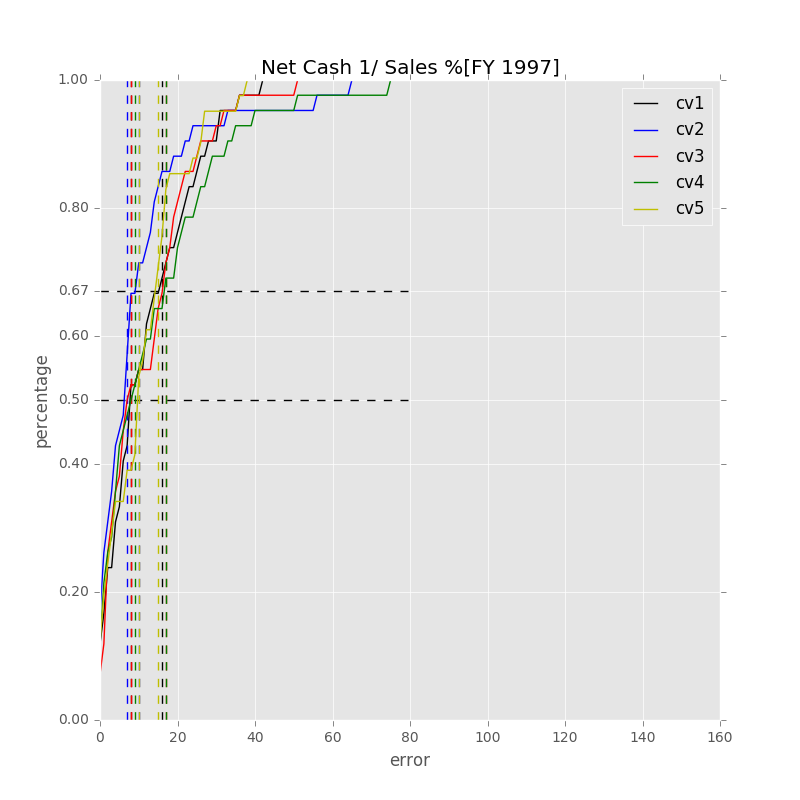

	Label: Net Cash 1/ Sales %[FY 1997]
	Average Min Error: 	0.004703
	Average Mean Error: 	13.311468
	Average Median Error: 	9.917774
	Average Max Error: 	77.491927

#####10-15
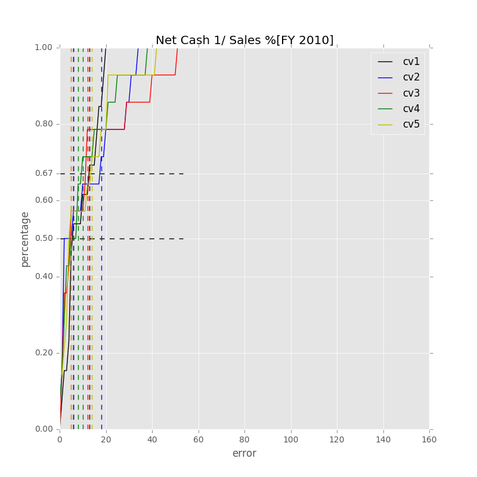

	Label: Net Cash 1/ Sales %[FY 2010]
	Average Min Error: 	0.945408
	Average Mean Error: 	18.585329
	Average Median Error: 	10.832122
	Average Max Error: 	72.781176

###预测误差
#####97-15
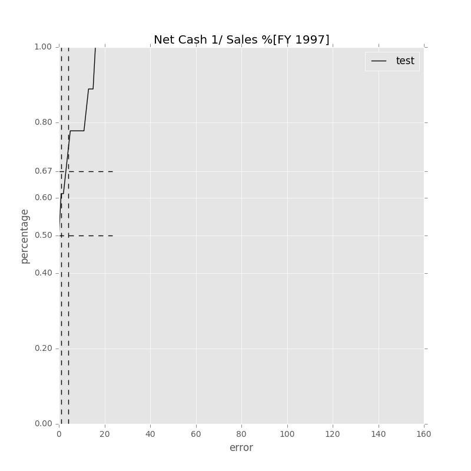

	Label: Net Cash 1/ Sales %[FY 1997]
	Min Error: 	0.000498
	Mean Error: 	4.400496
	Median Error: 	0.551733
	Max Error: 	12.112859
	Feature importance:
		Net Income Margin % : 0.066352
		Cash from Ops./Net Income% : 0.063954
		Total Asset Turnover : 0.059352
		Total Liabilities/Total Assets % : 0.058369
		Net Property, Plant & Equipment/ Total Assets % : 0.057740
		Rev YOY % : 0.057172
		Gross Margin % : 0.054426
		Avg. Cash Conversion Cycle  (Days): 0.051309
		Avg. Days Payable Out.  (Days): 0.051252
		Avg. Days Sales Out.  (Days): 0.050307
		R&D Exp./Total Revenue % : 0.049307
		Goodwill/Total Asset % : 0.045022
		Total Debt/Equity % : 0.044226
		Payout Ratio  (%): 0.028760
		cash flow risk: 0.021701
		Issuer Credit Rating - Foreign Currency LT [Latest] (Rating): 0.019751

	Total Min: 0.000498
	Total Mean: 4.400496
	Total Median: 0.551733
	Total Max: 12.112859
	prediction and real value:
	1998:	-0.999502    -1.000000
	1999:	-0.999502    -1.000000
	2000:	-0.999502    -1.000000
	2001:	-0.999502    -1.000000
	2002:	-0.999502    -1.000000
	2003:	-0.999502    -1.000000
	2004:	-0.999502    -1.000000
	2005:	-0.999502    -1.000000
	2006:	15.701746    5.712340
	2007:	18.711562    8.036704
	2008:	22.801968    11.825114
	2009:	12.722851    12.634866
	2010:	23.578309    13.417506
	2011:	29.381898    23.281000
	2012:	14.037742    20.602759
	2013:	18.551609    23.113289
	2014:	24.094643    24.646376
	2015:	14.926978    27.039837
	2016:	12.536100    24.359445

#####10-15
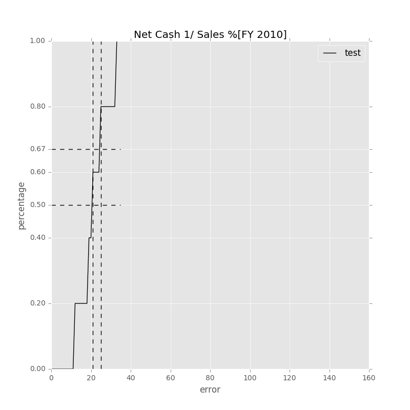

	Label: Net Cash 1/ Sales %[FY 2010]
	Min Error: 	6.475440
	Mean Error: 	10.552948
	Median Error: 	7.649207
	Max Error: 	17.848254
	Feature importance:
		Total Asset Turnover : 0.030674
		Total Liabilities/Total Assets % : 0.026590
		Net Property, Plant & Equipment/ Total Assets % : 0.025295
		Total Debt/Equity % : 0.024724
		Gross Margin % : 0.022984
		R&D Exp./Total Revenue % : 0.022980
		Avg. Days Sales Out.  (Days): 0.021784
		Rev YOY % : 0.020570
		Net Income Margin % : 0.020207
		Avg. Cash Conversion Cycle  (Days): 0.020016
		Goodwill/Total Asset % : 0.019356
		Cash from Ops./Net Income% : 0.019226
		Payout Ratio  (%): 0.017359
		Avg. Days Payable Out.  (Days): 0.017215
		cash flow risk: 0.009758
		Issuer Credit Rating - Foreign Currency LT [Latest] (Rating): 0.008263

	Total Min: 6.475440
	Total Mean: 10.552948
	Total Median: 7.649207
	Total Max: 17.848254
	prediction and real value:
	2011:	16.569065    23.281000
	2012:	14.127319    20.602759
	2013:	15.026707    23.113289
	2014:	17.434544    24.646376
	2015:	9.191583    27.039837
	2016:	7.375799    24.359445

###预测与真实值对比
#####97-15
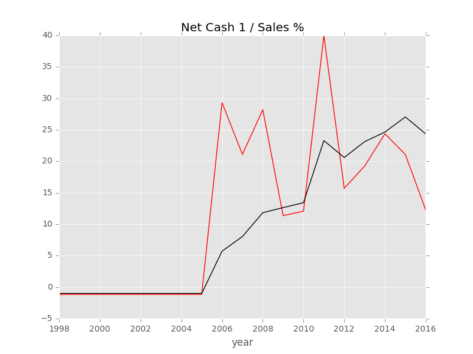
#####10-15
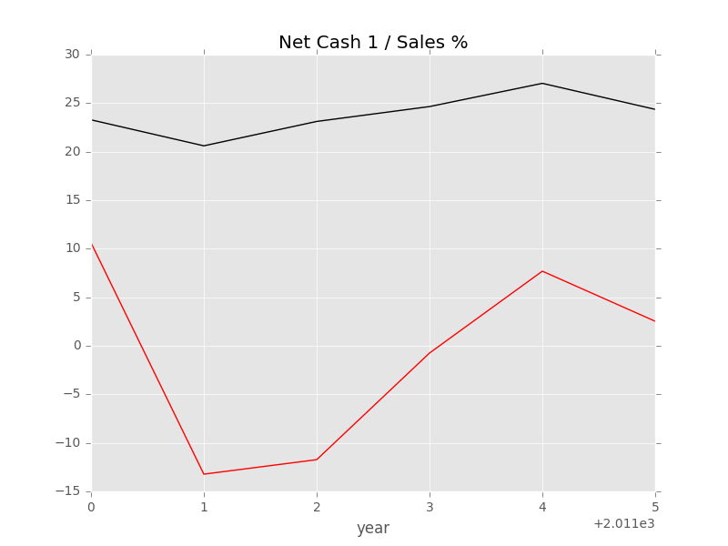

##ICT-Software and Services
###交叉验证
#####97-15
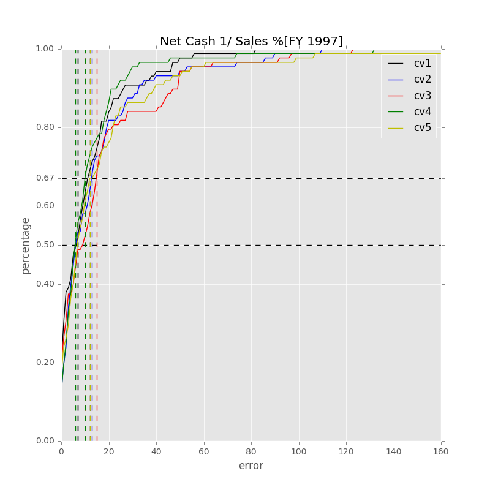

	Label: Net Cash 1/ Sales %[FY 1997]
	Average Min Error: 	0.001445
	Average Mean Error: 	30.075322
	Average Median Error: 	5.982531
	Average Max Error: 	1437.537520

#####10-15
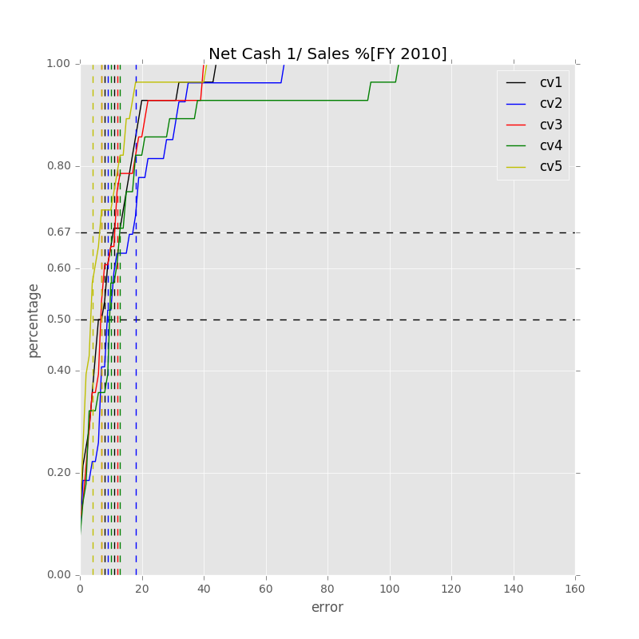

	Label: Net Cash 1/ Sales %[FY 2010]
	Average Min Error: 	0.698551
	Average Mean Error: 	14.564244
	Average Median Error: 	7.446667
	Average Max Error: 	66.195225

###预测误差
#####97-15
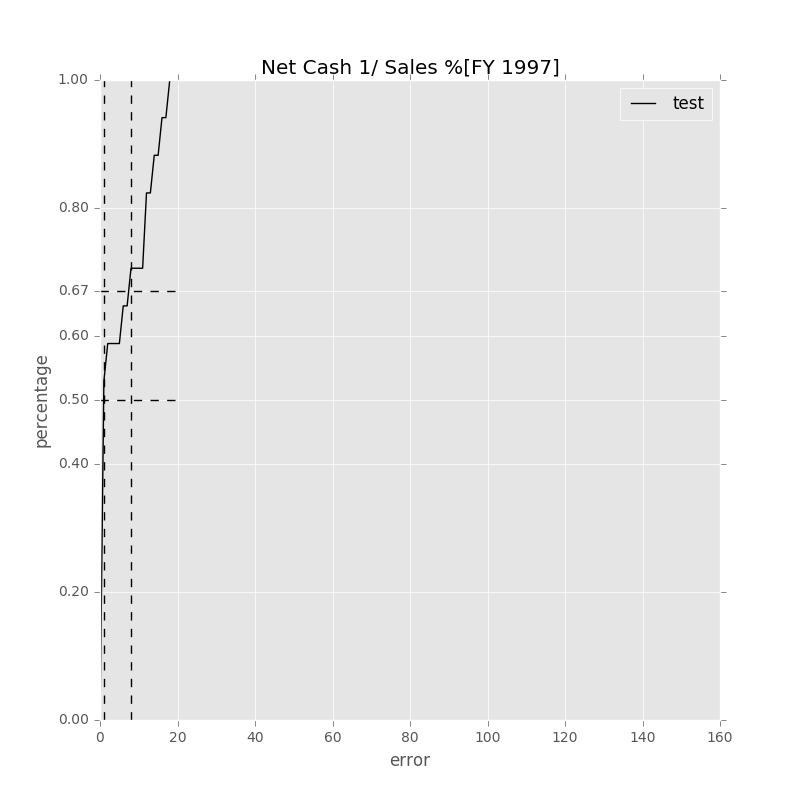

	Label: Net Cash 1/ Sales %[FY 1997]
	Min Error: 	0.500863
	Mean Error: 	12.107345
	Median Error: 	6.658451
	Max Error: 	35.439521
	Feature importance:
		Net Income Margin % : 0.086425
		Cash from Ops./Net Income% : 0.081517
		Rev YOY % : 0.076927
		Gross Margin % : 0.075759
		Total Asset Turnover : 0.075466
		Net Property, Plant & Equipment/ Total Assets % : 0.074452
		Total Liabilities/Total Assets % : 0.073458
		Avg. Days Sales Out.  (Days): 0.067885
		Goodwill/Total Asset % : 0.066978
		Avg. Cash Conversion Cycle  (Days): 0.064517
		Avg. Days Payable Out.  (Days): 0.061008
		Total Debt/Equity % : 0.055928
		R&D Exp./Total Revenue % : 0.048633
		Payout Ratio  (%): 0.033694
		cash flow risk: 0.032488
		Issuer Credit Rating - Foreign Currency LT [Latest] (Rating): 0.024866

	Total Min: 0.500863
	Total Mean: 12.107345
	Total Median: 6.658451
	Total Max: 35.439521
	prediction and real value:
	1998:	-0.499137    -1.000000
	1999:	-0.499137    -1.000000
	2000:	-0.499137    -1.000000
	2001:	-0.499137    -1.000000
	2002:	-0.499137    -1.000000
	2003:	-0.499137    -1.000000
	2004:	-0.499137    -1.000000
	2005:	-0.499137    -1.000000
	2006:	-2.435525    5.712340
	2007:	1.378253    8.036704
	2008:	8.417804    11.825114
	2009:	48.074387    12.634866
	2010:	42.224112    13.417506
	2011:	45.533009    23.281000
	2012:	43.730200    20.602759
	2013:	46.111595    23.113289
	2014:	49.300117    24.646376
	2015:	46.796509    27.039837
	2016:	55.144177    24.359445

#####10-15
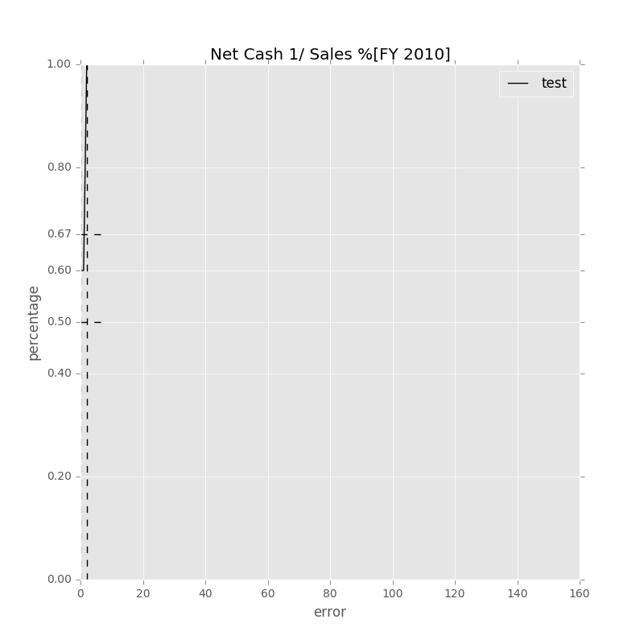

	Label: Net Cash 1/ Sales %[FY 2010]
	Min Error: 	0.193385
	Mean Error: 	4.429307
	Median Error: 	4.159435
	Max Error: 	12.719890
	Feature importance:
		Total Liabilities/Total Assets % : 0.061067
		Rev YOY % : 0.054856
		Cash from Ops./Net Income% : 0.048748
		Avg. Days Payable Out.  (Days): 0.045693
		Net Income Margin % : 0.044692
		Goodwill/Total Asset % : 0.044470
		Avg. Days Sales Out.  (Days): 0.043250
		Avg. Cash Conversion Cycle  (Days): 0.041656
		Gross Margin % : 0.040977
		Net Property, Plant & Equipment/ Total Assets % : 0.040795
		Total Debt/Equity % : 0.039981
		Total Asset Turnover : 0.039574
		R&D Exp./Total Revenue % : 0.030315
		Payout Ratio  (%): 0.023659
		cash flow risk: 0.014143
		Issuer Credit Rating - Foreign Currency LT [Latest] (Rating): 0.010124

	Total Min: 0.193385
	Total Mean: 4.429307
	Total Median: 4.159435
	Total Max: 12.719890
	prediction and real value:
	2011:	27.371354    23.281000
	2012:	20.409373    20.602759
	2013:	27.341805    23.113289
	2014:	25.622700    24.646376
	2015:	31.407211    27.039837
	2016:	37.079335    24.359445

###预测与真实值对比
#####97-15
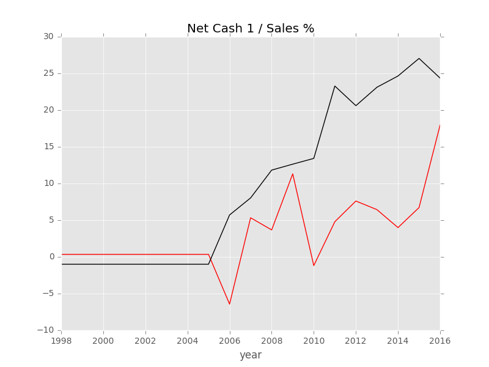
#####10-15
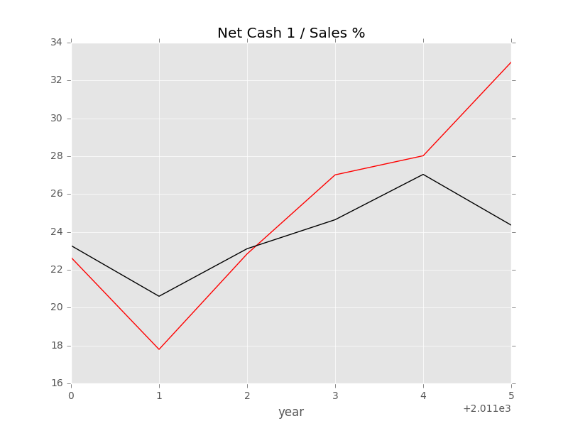

##ICT-Technology Hardware and Equipment
###交叉验证
#####97-15
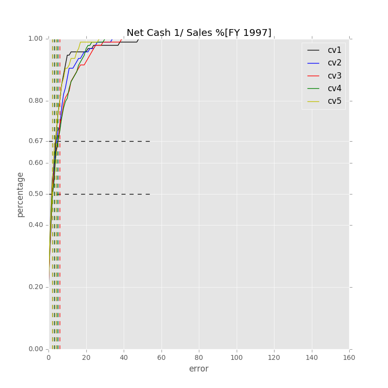

	Label: Net Cash 1/ Sales %[FY 1997]
	Average Min Error: 	0.000850
	Average Mean Error: 	5.384193
	Average Median Error: 	3.284494
	Average Max Error: 	40.739549

#####10-15
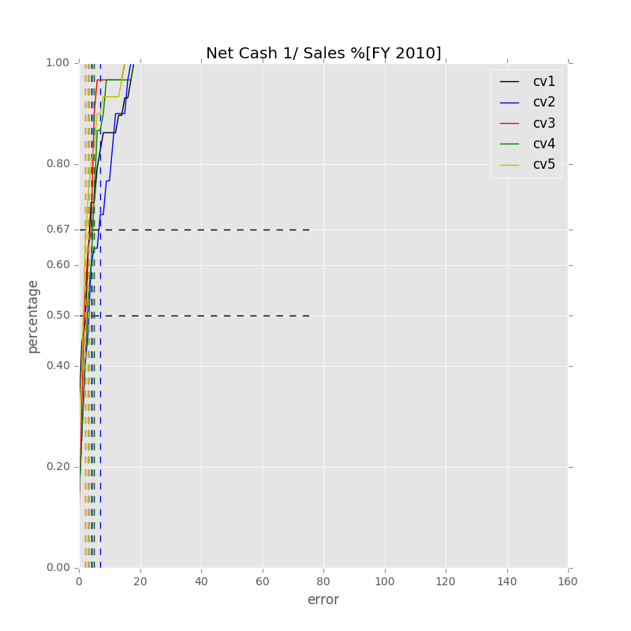

	Label: Net Cash 1/ Sales %[FY 2010]
	Average Min Error: 	0.024332
	Average Mean Error: 	3.927418
	Average Median Error: 	2.606643
	Average Max Error: 	15.027261

###预测误差
#####97-15
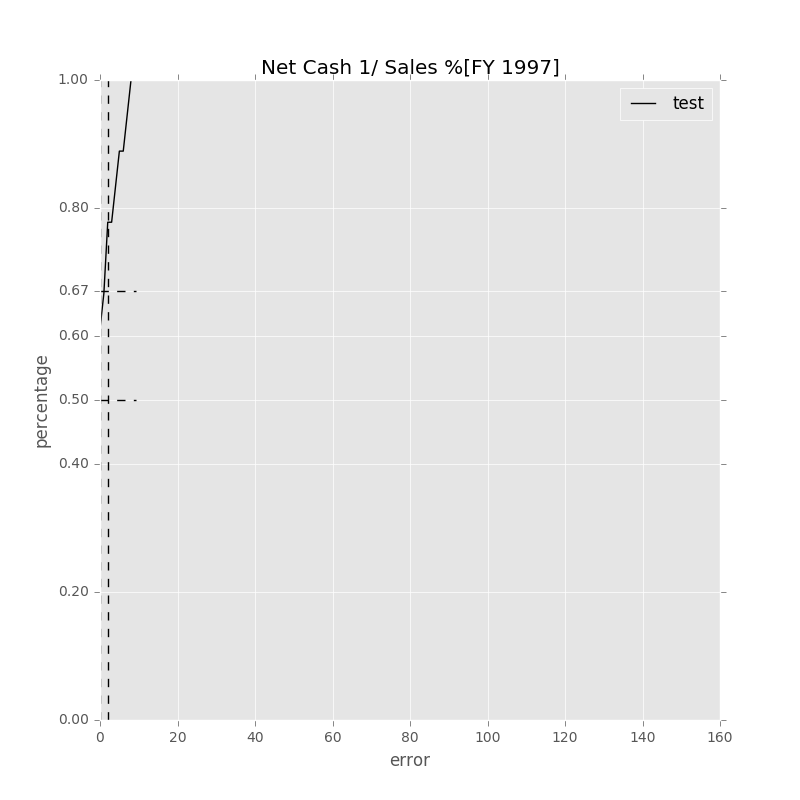

	Label: Net Cash 1/ Sales %[FY 1997]
	Min Error: 	0.180310
	Mean Error: 	4.190759
	Median Error: 	1.151411
	Max Error: 	11.951268
	Feature importance:
		Total Liabilities/Total Assets % : 0.079153
		Total Debt/Equity % : 0.078570
		Net Income Margin % : 0.074869
		Net Property, Plant & Equipment/ Total Assets % : 0.073789
		Rev YOY % : 0.073525
		Cash from Ops./Net Income% : 0.073524
		Avg. Cash Conversion Cycle  (Days): 0.070145
		Gross Margin % : 0.070028
		Avg. Days Sales Out.  (Days): 0.069148
		Total Asset Turnover : 0.068815
		Avg. Days Payable Out.  (Days): 0.065813
		Goodwill/Total Asset % : 0.055467
		R&D Exp./Total Revenue % : 0.047366
		Payout Ratio  (%): 0.045801
		cash flow risk: 0.034836
		Issuer Credit Rating - Foreign Currency LT [Latest] (Rating): 0.019150

	Total Min: 0.180310
	Total Mean: 4.190759
	Total Median: 1.151411
	Total Max: 11.951268
	prediction and real value:
	1998:	-0.716215    -1.000000
	1999:	-0.716215    -1.000000
	2000:	-0.716215    -1.000000
	2001:	-0.716215    -1.000000
	2002:	-0.716215    -1.000000
	2003:	-0.716215    -1.000000
	2004:	-0.716215    -1.000000
	2005:	-0.716215    -1.000000
	2006:	5.892650    5.712340
	2007:	4.441075    8.036704
	2008:	10.673703    11.825114
	2009:	2.529704    12.634866
	2010:	1.466238    13.417506
	2011:	15.485771    23.281000
	2012:	13.556791    20.602759
	2013:	16.608040    23.113289
	2014:	14.553615    24.646376
	2015:	18.521900    27.039837
	2016:	13.946232    24.359445

#####10-15
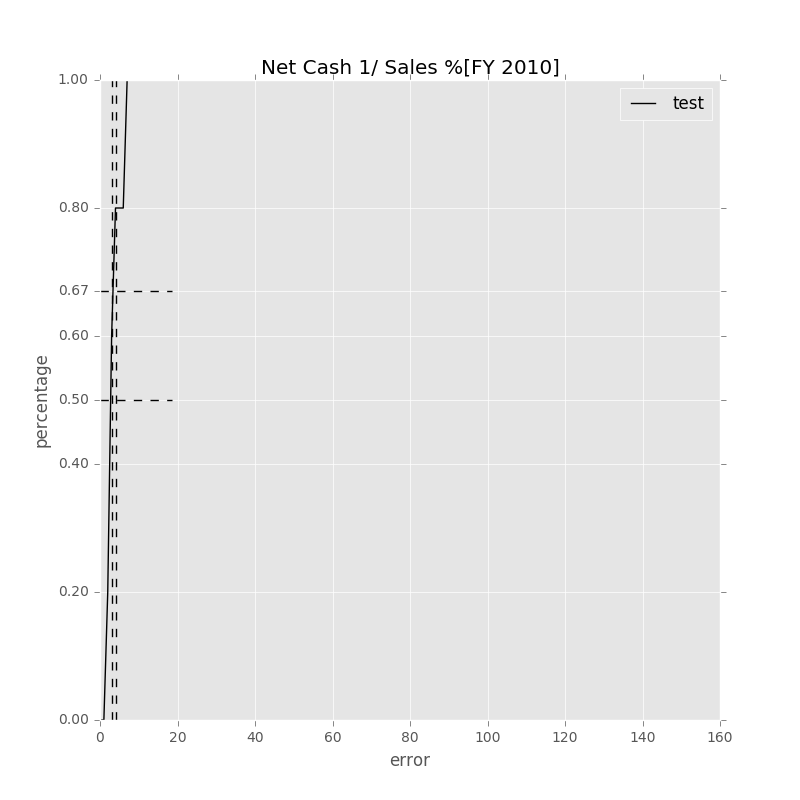

	Label: Net Cash 1/ Sales %[FY 2010]
	Min Error: 	1.706359
	Mean Error: 	8.425622
	Median Error: 	7.834917
	Max Error: 	15.414303
	Feature importance:
		Avg. Cash Conversion Cycle  (Days): 0.046892
		Cash from Ops./Net Income% : 0.045298
		Rev YOY % : 0.045002
		Total Asset Turnover : 0.043441
		Total Debt/Equity % : 0.043308
		Net Property, Plant & Equipment/ Total Assets % : 0.043226
		Goodwill/Total Asset % : 0.041912
		Total Liabilities/Total Assets % : 0.041800
		Net Income Margin % : 0.041371
		Gross Margin % : 0.039887
		Avg. Days Payable Out.  (Days): 0.039064
		Avg. Days Sales Out.  (Days): 0.037119
		R&D Exp./Total Revenue % : 0.029366
		Payout Ratio  (%): 0.028638
		cash flow risk: 0.013459
		Issuer Credit Rating - Foreign Currency LT [Latest] (Rating): 0.009217

	Total Min: 1.706359
	Total Mean: 8.425622
	Total Median: 7.834917
	Total Max: 15.414303
	prediction and real value:
	2011:	7.866697    23.281000
	2012:	6.944822    20.602759
	2013:	31.415455    23.113289
	2014:	26.352735    24.646376
	2015:	34.407505    27.039837
	2016:	28.464745    24.359445

###预测与真实值对比
#####97-15
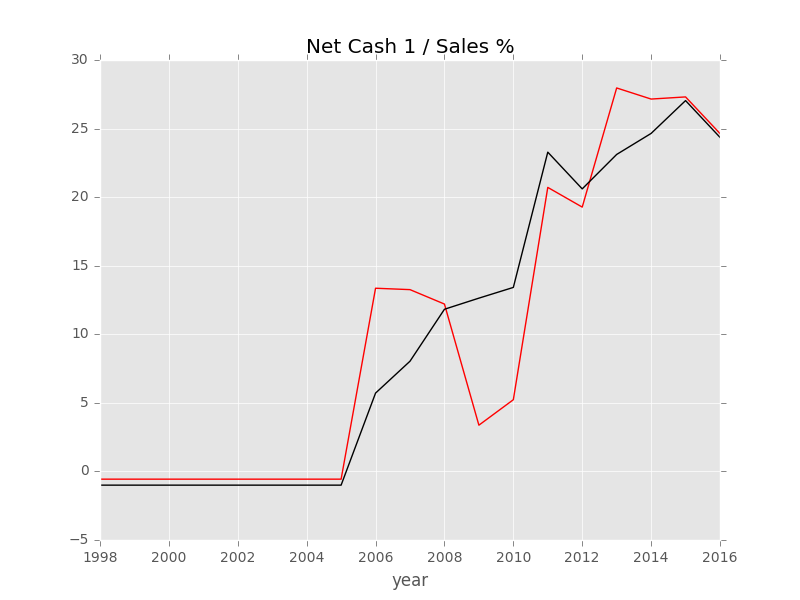
#####10-15
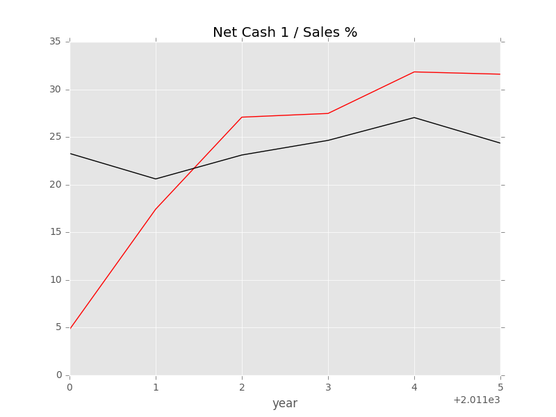

##预测16-20

	year:1997
	industry_label:[]
	[ 17.53517006   2.66982609   7.2662247    7.50909304  17.5127825 ]

	industry_label:0
	[  0.96334843  -1.63505246  18.39803322  14.52475357  14.93625273]

	industry_label:1
	[ 50.10875161   7.55485354   4.92730549   3.02831132  14.56917478]

	industry_label:2
	[ 6.33365083  2.15300245  4.72656675  4.30572699  7.21718038]

	year:2010
	industry_label:[]
	[ 13.57216354   6.83753324   5.86488073   7.23118476   7.27084134]

	industry_label:0
	[-5.12142108 -7.56381723 -8.26582913 -7.12250286 -3.37483465]

	industry_label:1
	[ 35.02487239  30.62245702  25.01229525  26.45082504  31.67117753]

	industry_label:2
	[ 0.91189521 -1.39080446 -0.1166942   1.60538823  1.31998324]

