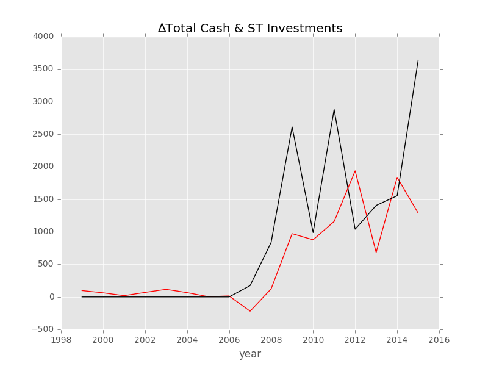

#现金收入比Y8模型
按照规定选择变量，分析了1个行业和总行业在两个时间段的情况，分别从交叉验证，预测误差，预测与真实情况的对比来展现结果

##交叉验证
###ICT
#####98-15

	Label: ∆Total Cash & ST Investments [FY 1998] ($USDmm, Current rate)
	Average Min Error: 	0.415907
	Average Mean Error: 	746.698805
	Average Median Error: 	272.560175
	Average Max Error: 	14728.215405

#####99-01

	Label: ∆Total Cash & ST Investments [FY 1999] ($USDmm, Current rate)
	Average Min Error: 	0.451962
	Average Mean Error: 	424.231603
	Average Median Error: 	199.015847
	Average Max Error: 	3104.539949

#####07-09

	Label: ∆Total Cash & ST Investments [FY 2007] ($USDmm, Current rate)
	Average Min Error: 	11.492663
	Average Mean Error: 	730.419257
	Average Median Error: 	391.143111
	Average Max Error: 	3839.651525

#####10-15

	Label: ∆Total Cash & ST Investments [FY 2010] ($USDmm, Current rate)
	Average Min Error: 	7.415094
	Average Mean Error: 	813.111209
	Average Median Error: 	398.813944
	Average Max Error: 	5283.781847

###ICT-Technology Hardware and Equipment
#####98-15

	Label: ∆Total Cash & ST Investments [FY 1998] ($USDmm, Current rate)
	Average Min Error: 	3.743841
	Average Mean Error: 	776.588620
	Average Median Error: 	334.387181
	Average Max Error: 	10912.237922

#####99-01

	Label: ∆Total Cash & ST Investments [FY 1999] ($USDmm, Current rate)
	Average Min Error: 	12.372283
	Average Mean Error: 	523.433445
	Average Median Error: 	263.644918
	Average Max Error: 	2652.118290

#####07-09

	Label: ∆Total Cash & ST Investments [FY 2007] ($USDmm, Current rate)
	Average Min Error: 	32.907517
	Average Mean Error: 	779.891094
	Average Median Error: 	475.515848
	Average Max Error: 	3778.646118

#####10-15

	Label: ∆Total Cash & ST Investments [FY 2010] ($USDmm, Current rate)
	Average Min Error: 	21.074163
	Average Mean Error: 	1152.607247
	Average Median Error: 	397.165144
	Average Max Error: 	11303.261558

##预测误差
###ICT
#####98-15

	Label: ∆Total Cash & ST Investments [FY 1998] ($USDmm, Current rate)
	Min Error: 	11.065678
	Mean Error: 	660.049926
	Median Error: 	179.515492
	Max Error: 	2544.914796
	Feature importance:
		Total Assets YOY %  : 0.105444
		∆Gross Margin % : 0.088020
		Rev YOY % : 0.086026
		∆EBITDA Margin % : 0.085883
		Capex/Rev %: 0.082300
		Cash Acquisitions/Total Revenue % : 0.078517
		R&D Exp./Total Revenue % : 0.076591
		Cash flow risk: 0.068828
		Payout Ratio  (%): 0.063515
		Issuer Credit Rating - Foreign Currency LT [Latest] (Rating): 0.049266
		Inflation (CPI) % in 1998: 0.048314
		USD LIBOR 3M % 1998: 0.032598
		EUR LIBOR 3M YOY % 1998: 0.028057
		USD LIBOR 3M YOY % 1998: 0.024594
		∆USD LIBOR 3M % 1998: 0.022564
		EUR LIBOR 3M %1998: 0.022533
		∆EUR LIBOR 3M % 1998: 0.021963
		Industry Dummy: 0.014987
		是否支付股利或股票回购1998: 0.000000

	Total Min: 11.065678
	Total Mean: 660.049926
	Total Median: 179.515492
	Total Max: 2544.914796
	prediction and real value:
	1999:	61.043101    -1.000000
	2000:	46.435441    -1.000000
	2001:	24.495977    -1.000000
	2002:	44.419400    -1.000000
	2003:	51.700861    -1.000000
	2004:	24.632529    -1.000000
	2005:	34.390166    -1.000000
	2006:	10.065678    -1.000000
	2007:	-187.374436    173.077000
	2008:	-504.493886    836.160000
	2009:	580.968613    2611.803230
	2010:	596.057825    988.539760
	2011:	336.149404    2881.064200
	2012:	-295.881667    1039.423820
	2013:	1049.559718    1405.275630
	2014:	1374.939518    1554.455010
	2015:	1261.889347    3637.681380

#####99-01

	Label: ∆Total Cash & ST Investments [FY 1999] ($USDmm, Current rate)
	Min Error: 	0.030329
	Mean Error: 	8.797802
	Median Error: 	10.784490
	Max Error: 	15.578585
	Feature importance:
		Cash flow risk: 0.119295
		Capex/Rev %: 0.090945
		Inflation (CPI) % in 1999: 0.090144
		Total Assets YOY % : 0.086048
		∆Gross Margin % : 0.081724
		Rev YOY % : 0.079181
		∆EBITDA Margin % : 0.076723
		R&D Exp./Total Revenue % : 0.067682
		Issuer Credit Rating - Foreign Currency LT [Latest] (Rating): 0.065596
		Payout Ratio  (%): 0.061841
		Cash Acquisitions/Total Revenue % : 0.056256
		Industry Dummy: 0.033539
		∆EUR LIBOR 3M % 1999: 0.019611
		EUR LIBOR 3M %1999: 0.016963
		EUR LIBOR 3M YOY % 1999: 0.014996
		∆USD LIBOR 3M % 1999: 0.014680
		USD LIBOR 3M % 1999: 0.012901
		USD LIBOR 3M YOY % 1999: 0.011874
		是否支付股利或股票回购1999: 0.000000

	Total Min: 0.030329
	Total Mean: 8.797802
	Total Median: 10.784490
	Total Max: 15.578585
	prediction and real value:
	2000:	-0.969671    -1.000000
	2001:	9.784490    -1.000000
	2002:	14.578585    -1.000000

#####07-09

	Label: ∆Total Cash & ST Investments [FY 2007] ($USDmm, Current rate)
	Min Error: 	182.041173
	Mean Error: 	640.193542
	Median Error: 	222.191454
	Max Error: 	1516.347999
	Feature importance:
		Capex/Rev %: 0.104721
		∆Gross Margin % : 0.102585
		∆EBITDA Margin % : 0.097344
		Total Assets YOY %  : 0.094619
		Rev YOY % : 0.091950
		Cash Acquisitions/Total Revenue % : 0.089980
		Cash flow risk: 0.089331
		R&D Exp./Total Revenue % : 0.081936
		Payout Ratio  (%): 0.065852
		Issuer Credit Rating - Foreign Currency LT [Latest] (Rating): 0.054544
		Inflation (CPI) % in 2007: 0.046198
		Industry Dummy: 0.020935
		∆USD LIBOR 3M % 2007: 0.011198
		USD LIBOR 3M YOY % 2007: 0.010796
		EUR LIBOR 3M YOY % 2007: 0.010283
		∆EUR LIBOR 3M % 2007: 0.009801
		EUR LIBOR 3M % 2007: 0.009227
		USD LIBOR 3M % 2007: 0.008701
		是否支付股利或股票回购2007: 0.000000

	Total Min: 182.041173
	Total Mean: 640.193542
	Total Median: 222.191454
	Total Max: 1516.347999
	prediction and real value:
	2008:	613.968546    836.160000
	2009:	1095.455231    2611.803230
	2010:	806.498587    988.539760

#####10-15

	Label: ∆Total Cash & ST Investments [FY 2010] ($USDmm, Current rate)
	Min Error: 	387.316788
	Mean Error: 	971.115267
	Median Error: 	687.172946
	Max Error: 	1737.273149
	Feature importance:
		Total Assets YOY %  : 0.103822
		Capex/Rev %: 0.097716
		Rev YOY % : 0.095933
		∆Gross Margin % : 0.094978
		∆EBITDA Margin % : 0.092677
		Cash Acquisitions/Total Revenue % : 0.090957
		R&D Exp./Total Revenue % : 0.073686
		Cash flow risk: 0.070589
		Payout Ratio  (%): 0.067083
		Issuer Credit Rating - Foreign Currency LT [Latest] (Rating): 0.052518
		Inflation (CPI) % in 2010: 0.045541
		USD LIBOR 3M % 2010: 0.018180
		EUR LIBOR 3M % 2010: 0.017510
		USD LIBOR 3M YOY % 2010: 0.017504
		EUR LIBOR 3M YOY % 2010: 0.016386
		∆EUR LIBOR 3M % 2010: 0.015581
		∆USD LIBOR 3M % 2010: 0.014877
		Industry Dummy: 0.014463
		是否支付股利或股票回购2010: 0.000000

	Total Min: 387.316788
	Total Mean: 971.115267
	Total Median: 687.172946
	Total Max: 1737.273149
	prediction and real value:
	2011:	1143.791051    2881.064200
	2012:	352.250874    1039.423820
	2013:	934.593182    1405.275630
	2014:	1167.138222    1554.455010
	2015:	2064.550375    3637.681380

###ICT-Technology Hardware and Equipment
#####98-15

	Label: ∆Total Cash & ST Investments [FY 1998] ($USDmm, Current rate)
	Min Error: 	7.983347
	Mean Error: 	759.913907
	Median Error: 	228.393504
	Max Error: 	3940.174443
	Feature importance:
		Total Assets YOY %  : 0.094499
		∆EBITDA Margin % : 0.092575
		∆Gross Margin % : 0.089925
		Capex/Rev %: 0.089032
		Rev YOY % : 0.087225
		Cash flow risk: 0.069841
		R&D Exp./Total Revenue % : 0.068359
		Payout Ratio  (%): 0.065887
		Cash Acquisitions/Total Revenue % : 0.062378
		Inflation (CPI) % in 1998: 0.062358
		USD LIBOR 3M % 1998: 0.036004
		Issuer Credit Rating - Foreign Currency LT [Latest] (Rating): 0.035882
		EUR LIBOR 3M YOY % 1998: 0.032781
		USD LIBOR 3M YOY % 1998: 0.029539
		EUR LIBOR 3M %1998: 0.029050
		∆USD LIBOR 3M % 1998: 0.028203
		∆EUR LIBOR 3M % 1998: 0.026461
		是否支付股利或股票回购1998: 0.000000
		Industry Dummy: 0.000000

	Total Min: 7.983347
	Total Mean: 759.913907
	Total Median: 228.393504
	Total Max: 3940.174443
	prediction and real value:
	1999:	52.870761    -1.000000
	2000:	49.994584    -1.000000
	2001:	-8.983347    -1.000000
	2002:	78.482201    -1.000000
	2003:	35.104633    -1.000000
	2004:	18.697139    -1.000000
	2005:	-33.862141    -1.000000
	2006:	-27.791579    -1.000000
	2007:	-162.803438    173.077000
	2008:	104.078083    836.160000
	2009:	35.619144    2611.803230
	2010:	760.146256    988.539760
	2011:	839.582400    2881.064200
	2012:	532.347405    1039.423820
	2013:	185.294864    1405.275630
	2014:	524.958349    1554.455010
	2015:	-302.493063    3637.681380

#####99-01

	Label: ∆Total Cash & ST Investments [FY 1999] ($USDmm, Current rate)
	Min Error: 	28.586601
	Mean Error: 	34.810224
	Median Error: 	36.076472
	Max Error: 	39.767599
	Feature importance:
		Cash flow risk: 0.068741
		Inflation (CPI) % in 1999: 0.057752
		Total Assets YOY % : 0.056380
		Rev YOY % : 0.053344
		Capex/Rev %: 0.052782
		∆Gross Margin % : 0.051896
		∆EBITDA Margin % : 0.051555
		R&D Exp./Total Revenue % : 0.031720
		Payout Ratio  (%): 0.030018
		Cash Acquisitions/Total Revenue % : 0.027842
		Issuer Credit Rating - Foreign Currency LT [Latest] (Rating): 0.026001
		∆EUR LIBOR 3M % 1999: 0.011494
		EUR LIBOR 3M %1999: 0.009846
		∆USD LIBOR 3M % 1999: 0.007100
		USD LIBOR 3M YOY % 1999: 0.006510
		USD LIBOR 3M % 1999: 0.006084
		EUR LIBOR 3M YOY % 1999: 0.005936
		是否支付股利或股票回购1999: 0.000000
		Industry Dummy: 0.000000

	Total Min: 28.586601
	Total Mean: 34.810224
	Total Median: 36.076472
	Total Max: 39.767599
	prediction and real value:
	2000:	-37.076472    -1.000000
	2001:	-29.586601    -1.000000
	2002:	-40.767599    -1.000000

#####07-09

	Label: ∆Total Cash & ST Investments [FY 2007] ($USDmm, Current rate)
	Min Error: 	301.778508
	Mean Error: 	715.098101
	Median Error: 	368.807909
	Max Error: 	1474.707885
	Feature importance:
		Total Assets YOY %  : 0.059375
		Rev YOY % : 0.057590
		∆Gross Margin % : 0.057470
		∆EBITDA Margin % : 0.055772
		Capex/Rev %: 0.054378
		Cash flow risk: 0.048158
		Cash Acquisitions/Total Revenue % : 0.040371
		R&D Exp./Total Revenue % : 0.038838
		Payout Ratio  (%): 0.034262
		Inflation (CPI) % in 2007: 0.030271
		Issuer Credit Rating - Foreign Currency LT [Latest] (Rating): 0.023217
		USD LIBOR 3M YOY % 2007: 0.007298
		USD LIBOR 3M % 2007: 0.006951
		EUR LIBOR 3M % 2007: 0.006436
		∆EUR LIBOR 3M % 2007: 0.006417
		EUR LIBOR 3M YOY % 2007: 0.006143
		∆USD LIBOR 3M % 2007: 0.006052
		是否支付股利或股票回购2007: 0.000000
		Industry Dummy: 0.000000

	Total Min: 301.778508
	Total Mean: 715.098101
	Total Median: 368.807909
	Total Max: 1474.707885
	prediction and real value:
	2008:	1137.938508    836.160000
	2009:	1137.095345    2611.803230
	2010:	619.731851    988.539760

#####10-15

	Label: ∆Total Cash & ST Investments [FY 2010] ($USDmm, Current rate)
	Min Error: 	1148.821177
	Mean Error: 	1888.258012
	Median Error: 	1553.184213
	Max Error: 	3075.448578
	Feature importance:
		Total Assets YOY %  : 0.097661
		Rev YOY % : 0.088855
		∆EBITDA Margin % : 0.087603
		Capex/Rev %: 0.079372
		∆Gross Margin % : 0.077011
		Cash Acquisitions/Total Revenue % : 0.065899
		R&D Exp./Total Revenue % : 0.064290
		Payout Ratio  (%): 0.057471
		Cash flow risk: 0.057051
		Inflation (CPI) % in 2010: 0.047983
		Issuer Credit Rating - Foreign Currency LT [Latest] (Rating): 0.032972
		USD LIBOR 3M % 2010: 0.017286
		EUR LIBOR 3M % 2010: 0.016214
		∆USD LIBOR 3M % 2010: 0.015170
		EUR LIBOR 3M YOY % 2010: 0.013462
		∆EUR LIBOR 3M % 2010: 0.013146
		USD LIBOR 3M YOY % 2010: 0.012553
		是否支付股利或股票回购2010: 0.000000
		Industry Dummy: 0.000000

	Total Min: 1148.821177
	Total Mean: 1888.258012
	Total Median: 1553.184213
	Total Max: 3075.448578
	prediction and real value:
	2011:	671.682991    2881.064200
	2012:	2493.878703    1039.423820
	2013:	-147.908583    1405.275630
	2014:	405.633833    1554.455010
	2015:	562.232802    3637.681380

##预测与真实值对比
###ICT
#####98-15

#####99-01

#####07-09

#####10-15

###ICT-Technology Hardware and Equipment
#####98-15

#####99-01

#####07-09

#####10-15

##预测16-20

	year:1998-2015
		industry_label:[]
		[ 227.16343745  357.4133976   143.49675724   65.60361947   92.83233168]

		industry_label:2
		[ -23.7545198   326.25804285  408.33084065   60.36485397   71.82882782]

	year:2010-2015
		industry_label:[]
		[ 266.56157231  581.7501532  -305.72294031  -28.05274215   30.38120852]

		industry_label:2
		[ 337.84760193  529.37086056  195.35323708   14.94776601    7.47478801]

	year:1999-2002
		industry_label:[]
		[ 983.80467735  364.68280615  129.15812163   93.45294113   94.00430243]

		industry_label:2
		[ 792.28022188  325.07888081  312.39983614  397.08025485  286.28101461]

	year:2007-2010
		industry_label:[]
		[ 426.79086597  261.62850382  215.36078182  248.81066787  216.92309827]

		industry_label:2
		[ 1264.09741258   339.49945745   434.67202585   395.23737436   365.93458424]

	

