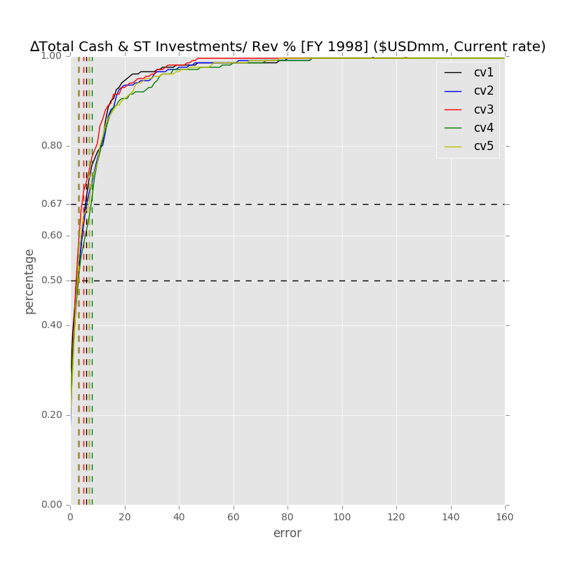
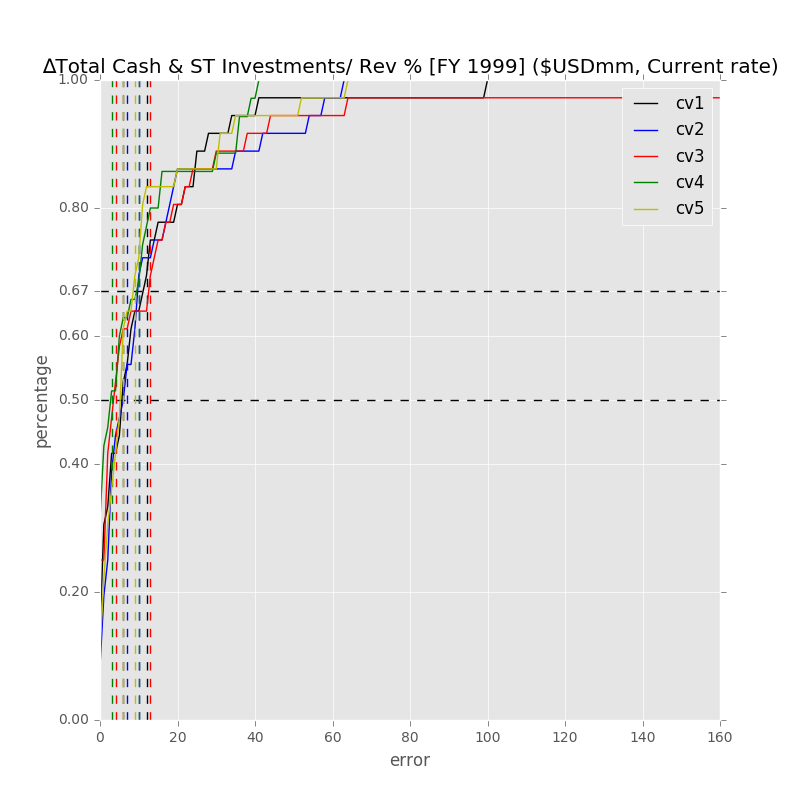
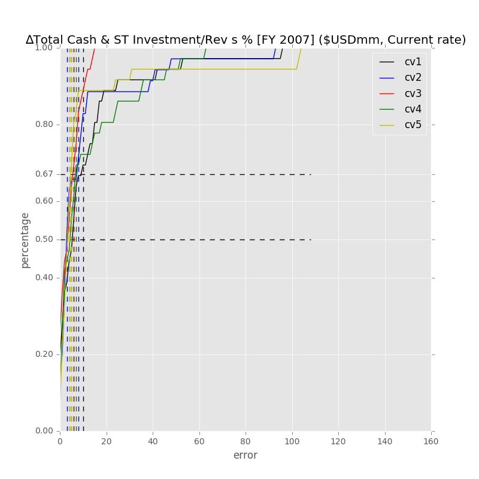
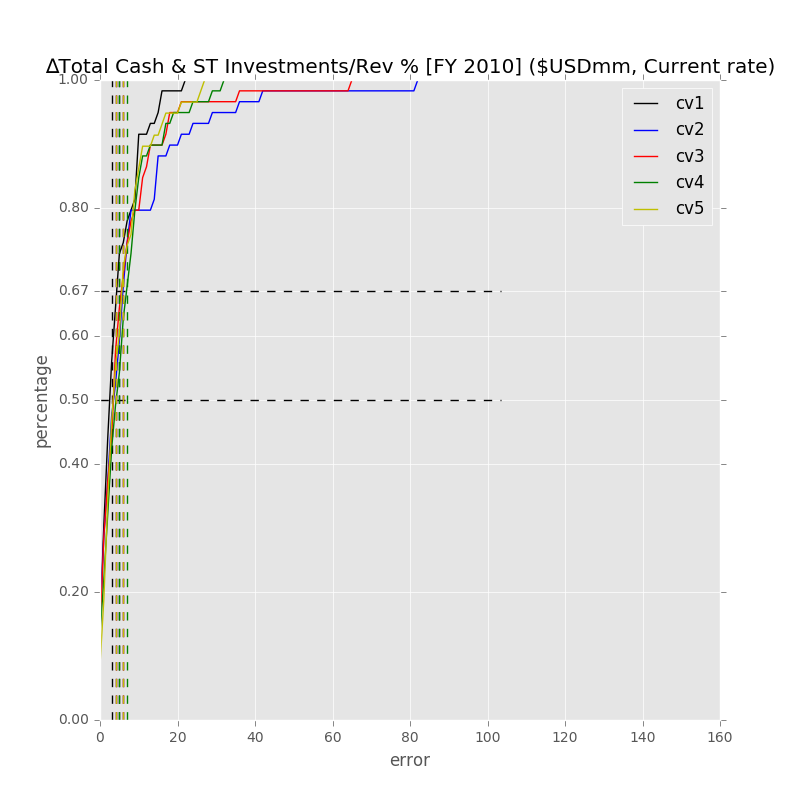
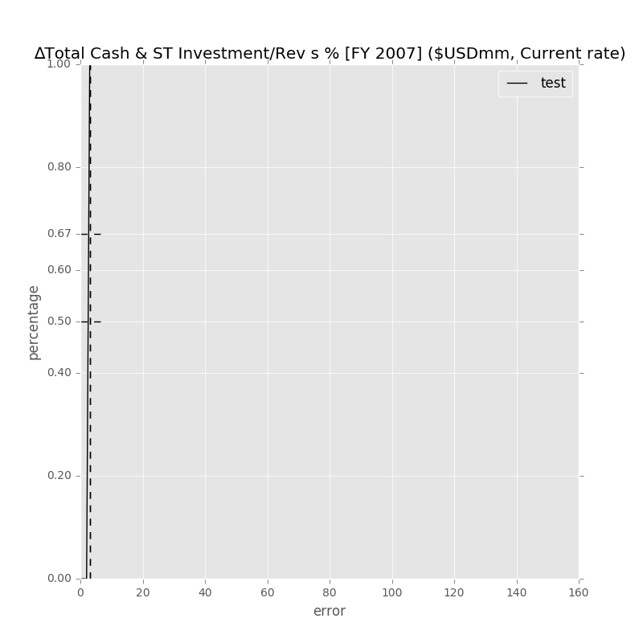
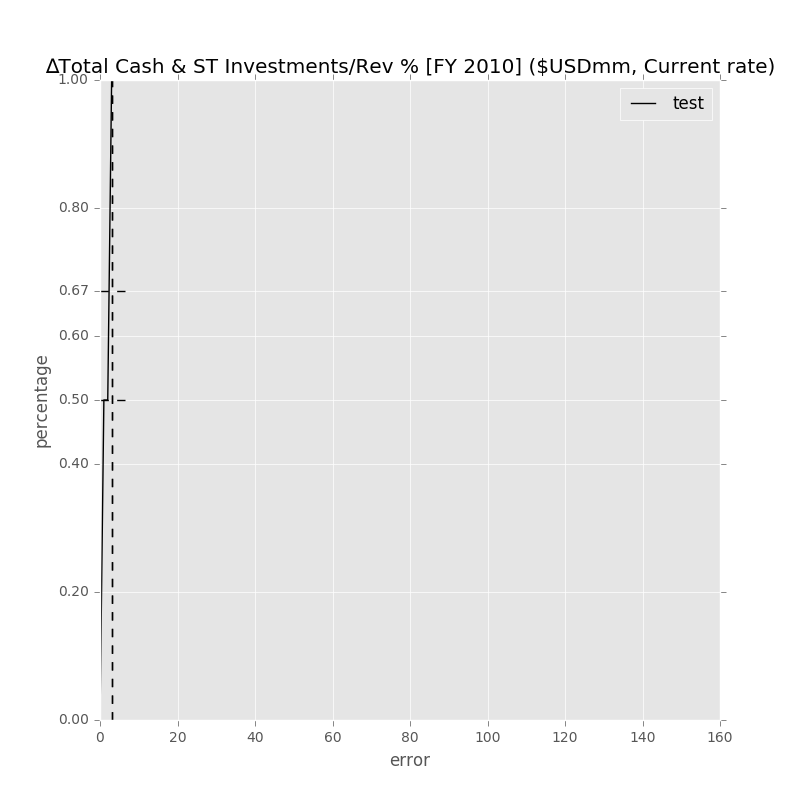
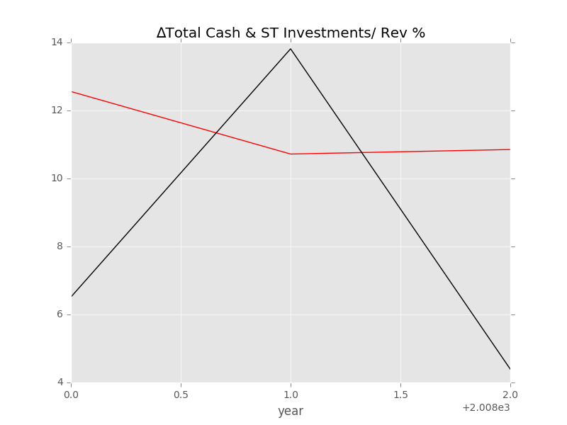
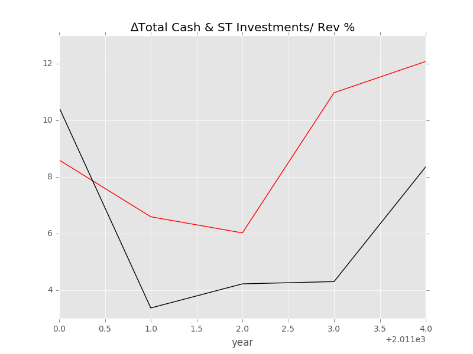

#现金收入比Y9模型
按照规定选择变量，分析了3个行业和总行业在两个时间段的情况，分别从交叉验证，预测误差，预测与真实情况的对比来展现结果

##交叉验证
###ICT
#####98-15

	Label: ∆Total Cash & ST Investments/ Rev % [FY 1998] ($USDmm, Current rate)
	Average Min Error: 	0.004398
	Average Mean Error: 	9.557410
	Average Median Error: 	3.954431
	Average Max Error: 	182.012805

#####99-01

	Label: ∆Total Cash & ST Investments/ Rev % [FY 1999] ($USDmm, Current rate)
	Average Min Error: 	0.038737
	Average Mean Error: 	10.569360
	Average Median Error: 	4.398067
	Average Max Error: 	89.512627

#####07-09

	Label: ∆Total Cash & ST Investment/Rev s % [FY 2007] ($USDmm, Current rate)
	Average Min Error: 	0.127973
	Average Mean Error: 	9.405516
	Average Median Error: 	5.231229
	Average Max Error: 	59.911441

#####10-15

	Label: ∆Total Cash & ST Investments/Rev % [FY 2010] ($USDmm, Current rate)
	Average Min Error: 	0.246385
	Average Mean Error: 	7.626122
	Average Median Error: 	4.340471
	Average Max Error: 	50.469126

###ICT-Technology Hardware and Equipment
#####98-15

	Label: ∆Total Cash & ST Investments/ Rev % [FY 1998] ($USDmm, Current rate)
	Average Min Error: 	0.032186
	Average Mean Error: 	5.298681
	Average Median Error: 	2.872552
	Average Max Error: 	41.183512

#####99-01

	Label: ∆Total Cash & ST Investments/ Rev % [FY 1999] ($USDmm, Current rate)
	Average Min Error: 	0.130288
	Average Mean Error: 	5.656731
	Average Median Error: 	2.636016
	Average Max Error: 	33.678972

#####07-09

	Label: ∆Total Cash & ST Investment/Rev s % [FY 2007] ($USDmm, Current rate)
	Average Min Error: 	0.542723
	Average Mean Error: 	5.029242
	Average Median Error: 	3.509192
	Average Max Error: 	18.705797

#####10-15

	Label: ∆Total Cash & ST Investments/Rev % [FY 2010] ($USDmm, Current rate)
	Average Min Error: 	0.277322
	Average Mean Error: 	5.014769
	Average Median Error: 	3.357004
	Average Max Error: 	25.173349

##预测误差
###ICT
#####98-15

		Label: ∆Total Cash & ST Investments/ Rev % [FY 1998] ($USDmm, Current rate)
	Min Error: 	0.017153
	Mean Error: 	1.918605
	Median Error: 	0.494427
	Max Error: 	9.617119
	Feature importance:
		Total Assets YOY %  : 0.131536
		Rev YOY % : 0.112320
		Capex/Rev %: 0.102215
		∆Gross Margin % : 0.100186
		∆NI Margin % : 0.098513
		R&D Exp./Total Revenue % : 0.087431
		Cash Acquisitions/Total Revenue % : 0.082577
		Cash flow risk: 0.075207
		Payout Ratio  (%): 0.062871
		Inflation (CPI) % in 1998: 0.058544
		USD LIBOR 3M % 1998: 0.042985
		EUR LIBOR 3M %1998: 0.039145
		是否支付股利或股票回购1998: 0.006470

	Total Min: 0.017153
	Total Mean: 1.918605
	Total Median: 0.494427
	Total Max: 9.617119
	prediction and real value:
	1999:	-0.874520    -1.000000
	2000:	-0.897417    -1.000000
	2001:	-0.603970    -1.000000
	2002:	-1.198195    -1.000000
	2003:	-1.017153    -1.000000
	2004:	-0.505573    -1.000000
	2005:	-0.764131    -1.000000
	2006:	-1.736106    -1.000000
	2007:	7.120176    2.035267
	2008:	5.767703    6.512092
	2009:	14.199856    13.814188
	2010:	8.908023    4.392221
	2011:	12.128169    10.452593
	2012:	7.350111    3.375685
	2013:	4.142415    4.226651
	2014:	13.924199    4.307081
	2015:	12.587877    8.359560

#####99-01

		Label: ∆Total Cash & ST Investments/ Rev % [FY 1999] ($USDmm, Current rate)
	Min Error: 	0.197433
	Mean Error: 	0.379198
	Median Error: 	0.442674
	Max Error: 	0.497486
	Feature importance:
		∆NI Margin % : 0.144681
		Cash flow risk: 0.102713
		Total Assets YOY % : 0.097896
		Rev YOY % : 0.090250
		Capex/Rev %: 0.088157
		∆Gross Margin % : 0.085676
		Inflation (CPI) % in 1999: 0.074320
		R&D Exp./Total Revenue % : 0.064958
		Payout Ratio  (%): 0.055839
		Issuer Credit Rating - Foreign Currency LT [Latest] (Rating): 0.055575
		Cash Acquisitions/Total Revenue % : 0.051252
		EUR LIBOR 3M %1999: 0.028466
		USD LIBOR 3M % 1999: 0.025940
		Industry Dummy: 0.025492
		是否支付股利或股票回购1999: 0.008787

	Total Min: 0.197433
	Total Mean: 0.379198
	Total Median: 0.442674
	Total Max: 0.497486
	prediction and real value:
	2000:	-1.497486    -1.000000
	2001:	-1.442674    -1.000000
	2002:	-0.802567    -1.000000

#####07-09

		Label: ∆Total Cash & ST Investment/Rev s % [FY 2007] ($USDmm, Current rate)
	Min Error: 	0.696184
	Mean Error: 	3.485424
	Median Error: 	4.371887
	Max Error: 	5.388201
	Feature importance:
		Total Assets YOY %  : 0.098038
		∆NI Margin % : 0.090559
		Rev YOY % : 0.083519
		Capex/Rev %: 0.082358
		∆Gross Margin % : 0.081495
		Cash Acquisitions/Total Revenue % : 0.072487
		Cash flow risk: 0.065989
		R&D Exp./Total Revenue % : 0.065458
		Payout Ratio  (%): 0.047656
		Inflation (CPI) % in 2007: 0.045426
		Issuer Credit Rating - Foreign Currency LT [Latest] (Rating): 0.036289
		USD LIBOR 3M % 2007: 0.016349
		EUR LIBOR 3M % 2007: 0.015375
		Industry Dummy: 0.014576
		是否支付股利或股票回购2007: 0.005426

	Total Min: 0.696184
	Total Mean: 3.485424
	Total Median: 4.371887
	Total Max: 5.388201
	prediction and real value:
	2008:	10.883980    6.512092
	2009:	14.510372    13.814188
	2010:	9.780422    4.392221

#####10-15

		Label: ∆Total Cash & ST Investments/Rev % [FY 2010] ($USDmm, Current rate)
	Min Error: 	2.126370
	Mean Error: 	5.337643
	Median Error: 	5.406925
	Max Error: 	9.014695
	Feature importance:
		Total Assets YOY %  : 0.117308
		∆Gross Margin % : 0.104902
		Capex/Rev %: 0.102803
		∆NI Margin % : 0.101878
		Rev YOY % : 0.096286
		Cash Acquisitions/Total Revenue % : 0.086123
		R&D Exp./Total Revenue % : 0.080639
		Payout Ratio  (%): 0.073090
		Cash flow risk: 0.072312
		Inflation (CPI) % in 2010: 0.055478
		Issuer Credit Rating - Foreign Currency LT [Latest] (Rating): 0.034547
		USD LIBOR 3M % 2010: 0.028614
		EUR LIBOR 3M % 2010: 0.025322
		Industry Dummy: 0.014888
		是否支付股利或股票回购2010: 0.005812

	Total Min: 2.126370
	Total Mean: 5.337643
	Total Median: 5.406925
	Total Max: 9.014695
	prediction and real value:
	2011:	8.326224    10.452593
	2012:	8.782610    3.375685
	2013:	8.119920    4.226651
	2014:	13.321776    4.307081
	2015:	14.606517    8.359560

###ICT-Technology Hardware and Equipment
#####98-15

		Label: ∆Total Cash & ST Investments/ Rev % [FY 1998] ($USDmm, Current rate)
	Min Error: 	0.028895
	Mean Error: 	1.883130
	Median Error: 	1.056601
	Max Error: 	7.853619
	Feature importance:
		Total Assets YOY %  : 0.121894
		∆Gross Margin % : 0.112526
		Rev YOY % : 0.111878
		∆NI Margin % : 0.103788
		Capex/Rev %: 0.100570
		R&D Exp./Total Revenue % : 0.076723
		Inflation (CPI) % in 1998: 0.073753
		Payout Ratio  (%): 0.066647
		Cash Acquisitions/Total Revenue % : 0.064980
		Cash flow risk: 0.063530
		USD LIBOR 3M % 1998: 0.055215
		EUR LIBOR 3M %1998: 0.041968
		是否支付股利或股票回购1998: 0.006530

	Total Min: 0.028895
	Total Mean: 1.883130
	Total Median: 1.056601
	Total Max: 7.853619
	prediction and real value:
	1999:	-0.914692    -1.000000
	2000:	-0.931654    -1.000000
	2001:	-0.971105    -1.000000
	2002:	-1.211527    -1.000000
	2003:	-0.345459    -1.000000
	2004:	-0.611287    -1.000000
	2005:	-0.576950    -1.000000
	2006:	-2.374196    -1.000000
	2007:	3.091868    2.035267
	2008:	7.064819    6.512092
	2009:	5.960569    13.814188
	2010:	2.622214    4.392221
	2011:	4.014631    10.452593
	2012:	4.648892    3.375685
	2013:	2.865064    4.226651
	2014:	5.909498    4.307081
	2015:	1.489059    8.359560

#####99-01

		Label: ∆Total Cash & ST Investments/ Rev % [FY 1999] ($USDmm, Current rate)
	Min Error: 	0.181901
	Mean Error: 	0.315342
	Median Error: 	0.357811
	Max Error: 	0.406314
	Feature importance:
		Rev YOY % : 0.048903
		∆NI Margin % : 0.047325
		Total Assets YOY % : 0.045269
		∆Gross Margin % : 0.042645
		Capex/Rev %: 0.035196
		Cash flow risk: 0.033527
		Inflation (CPI) % in 1999: 0.028345
		Payout Ratio  (%): 0.024309
		Cash Acquisitions/Total Revenue % : 0.022742
		R&D Exp./Total Revenue % : 0.022682
		Issuer Credit Rating - Foreign Currency LT [Latest] (Rating): 0.016402
		USD LIBOR 3M % 1999: 0.009056
		EUR LIBOR 3M %1999: 0.008193
		是否支付股利或股票回购1999: 0.005406

	Total Min: 0.181901
	Total Mean: 0.315342
	Total Median: 0.357811
	Total Max: 0.406314
	prediction and real value:
	2000:	-1.181901    -1.000000
	2001:	-1.357811    -1.000000
	2002:	-1.406314    -1.000000

#####07-09

		Label: ∆Total Cash & ST Investment/Rev s % [FY 2007] ($USDmm, Current rate)
	Min Error: 	0.723261
	Mean Error: 	4.632139
	Median Error: 	3.509290
	Max Error: 	9.663868
	Feature importance:
		Total Assets YOY %  : 0.042654
		Rev YOY % : 0.041342
		∆Gross Margin % : 0.037331
		∆NI Margin % : 0.037072
		Capex/Rev %: 0.036290
		R&D Exp./Total Revenue % : 0.031386
		Cash flow risk: 0.029678
		Payout Ratio  (%): 0.029523
		Cash Acquisitions/Total Revenue % : 0.028216
		Inflation (CPI) % in 2007: 0.022829
		Issuer Credit Rating - Foreign Currency LT [Latest] (Rating): 0.016494
		USD LIBOR 3M % 2007: 0.011053
		EUR LIBOR 3M % 2007: 0.009160
		是否支付股利或股票回购2007: 0.003970

	Total Min: 0.723261
	Total Mean: 4.632139
	Total Median: 3.509290
	Total Max: 9.663868
	prediction and real value:
	2008:	10.021382    6.512092
	2009:	4.150320    13.814188
	2010:	3.668960    4.392221

#####10-15

		Label: ∆Total Cash & ST Investments/Rev % [FY 2010] ($USDmm, Current rate)
	Min Error: 	0.032937
	Mean Error: 	2.524736
	Median Error: 	3.273025
	Max Error: 	4.246105
	Feature importance:
		Total Assets YOY %  : 0.070244
		∆Gross Margin % : 0.065254
		Rev YOY % : 0.060376
		Capex/Rev %: 0.059503
		∆NI Margin % : 0.057241
		Cash Acquisitions/Total Revenue % : 0.044920
		Payout Ratio  (%): 0.043447
		Inflation (CPI) % in 2010: 0.042721
		R&D Exp./Total Revenue % : 0.041906
		Cash flow risk: 0.037420
		USD LIBOR 3M % 2010: 0.018592
		Issuer Credit Rating - Foreign Currency LT [Latest] (Rating): 0.017671
		EUR LIBOR 3M % 2010: 0.017295
		是否支付股利或股票回购2010: 0.004411

	Total Min: 0.032937
	Total Mean: 2.524736
	Total Median: 3.273025
	Total Max: 4.246105
	prediction and real value:
	2011:	6.458555    10.452593
	2012:	6.648710    3.375685
	2013:	4.259587    4.226651
	2014:	8.553186    4.307081
	2015:	7.281985    8.359560

##预测与真实数据的对比
###ICT
#####98-15

#####99-01

#####07-09

#####10-15

###ICT-Technology Hardware and Equipment
#####98-15

#####99-01

#####07-09

#####10-15

##预测16-20

	year:1998-2015
		industry_label:[]
		[  9.54806888  11.10682814  13.1989102    5.19436059   9.25742897]

		industry_label:2
		[ 6.49858984  6.7488973   6.42246579  2.90976371  1.92954588]

	year:2010-2015
		industry_label:[]
		[ 5.75919958  5.07230072  5.25545536  5.28559595  4.37988437]

		industry_label:2
		[ 2.68783202  1.96702291  2.20809231  1.10109914  0.60361547]

	year:1999-2002
		industry_label:[]
		[ 13.53519012  14.85255411  11.98613702  10.665955    11.00267371]

		industry_label:2
		[ 4.56081411  5.8578334   5.36293674  6.00106627  5.95642214]

	year:2007-2010
		industry_label:[]
		[ 3.31120233  2.1300581   3.19623514  3.51505168  2.48398892]

		industry_label:2
		[ 5.22913039  4.28772098  3.44007658  2.72342522  1.60997016]

